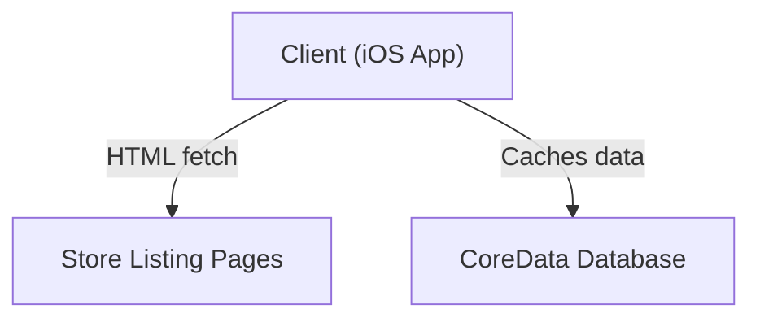

# StoreScout

*Your guide to every app store — all in one place.*

StoreScout is a curated discovery app that tracks apps appearing across the new rival stores launching inside Google Play. It helps power users and app enthusiasts find hidden gems before they go mainstream by providing a unified 'new arrivals' feed. The app works entirely on-device by scraping publicly available store listing pages and caching results locally, ensuring a seamless user experience without the need for a backend.

## Features

- Unified 'New This Week' feed aggregating app launches across new rival stores.
- One-tap deep-link to install apps directly from their respective storefront.
- Watchlist with local push notifications for price drops or major updates.

## Tech Stack

- **Frontend**: 
  - SwiftUI (iOS 17+)
  - Swift 5.7+
- **Backend**: 
  - None (On-device processing)
- **Database**: 
  - CoreData
- **Infrastructure**: 
  - URLSession for networking
  - SwiftSoup for HTML parsing

## Architecture

StoreScout uses an on-device architecture where all data processing and scraping are done locally without a backend server. The app fetches and parses store listings via URLSession and SwiftSoup, caching results with CoreData.



## Project Structure

```plaintext
StoreScout/
├── StoreScoutApp.swift
├── Views/
│   ├── ContentView.swift
│   ├── DiscoverView.swift
│   ├── WatchlistView.swift
│   ├── SettingsView.swift
│   ├── AppCardView.swift
├── ViewModels/
│   ├── DiscoverViewModel.swift
│   ├── WatchlistViewModel.swift
│   ├── SettingsViewModel.swift
├── Services/
│   ├── AppScraperService.swift
│   ├── NotificationService.swift
│   ├── SubscriptionService.swift
├── Models/
│   ├── App.swift
│   ├── Store.swift
│   ├── WatchlistItem.swift
├── Utilities/
│   ├── Constants.swift
│   ├── Extensions.swift
│   ├── CacheManager.swift
├── CoreData/
│   ├── StoreScout.xcdatamodeld
├── Resources/
│   ├── Assets.xcassets
│   ├── Localizable.strings
├── Info.plist
```

## Getting Started

### Prerequisites

- Xcode 14 or later
- iOS 17+ device or simulator

### Installation

1. Clone the repository:
   ```bash
   git clone https://github.com/yourusername/StoreScout.git
   ```

2. Open the Xcode project:
   ```bash
   cd StoreScout
   open StoreScout.xcodeproj
   ```

### Environment Variables

- Refer to the `.env.example` file to configure any necessary environment variables.

### Running

- Build and run the app in Xcode by selecting a target device and clicking the "Run" button.

## Documentation

- [Product Requirements](docs/PRD.md)
- [Design Brief](docs/DESIGN.md)
- [Architecture](docs/ARCHITECTURE.md)

## License

This project is licensed under the MIT License.